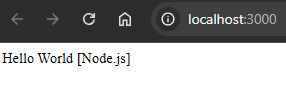

# tutoNode

A lightweight Node.js application using Express that serves a simple "Hello World" message through an HTTP server, which can be viewed in your browser.

## Description

This project demonstrates the basic setup of an Express server. It listens for HTTP requests and responds with the "Hello World" message. It is an ideal starting point for those beginning with Node.js or wanting to understand its fundamentals.

<div align="center">
    
</div>

## Requirements

- [Node.js](https://nodejs.org) (version 14 or higher)
- [npm](https://npmjs.com)
- Docker (if you want to run the application in a container)

## Installation

1. Clone the repository:
   ```bash
   git clone https://github.com/Jonablo/tutoNode.git
   ```

2. Navigate to the project folder:
   ```bash
   cd tutoNode
   ```

3. Install the dependencies:
   ```bash
   npm install
   ```

## Running the Application

### Running Locally with Node.js

To start the application locally, run the following command:
```bash
npm start
```
The application will be available in your browser at `http://localhost:3000`, where you will see the "Hello World" message.

### Running with Docker

If you prefer to run the application in Docker, first pull the image with the following command:

```bash
docker pull jonablo/node-app
```

Then, run the container with the following command, specifying the desired port:

```bash
docker run -p <desired_port>:3000 jonablo/node-app
```

The application will be available at `http://localhost:<desired_port>` in your browser.

## Contributions

If you have any ideas or improvements, they are welcome! Just fork the repository, create a branch for your changes, make the modifications, push them, and open a pull request to share them.

## License

This project is licensed under the MIT License.